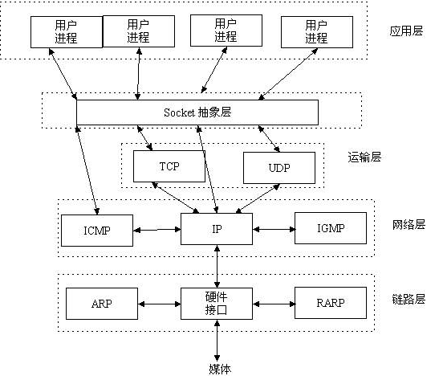

##二、socket(套接字)基础

###1.1 socket的由来
socket又名套接字，我们已经知道，假设我现在要写一个程序，给另一台计算机发数据，必须通过tcp/ip协议 ，但具体的实现过程是什么呢？我应该怎么操作才能把数据封装成tcp/ip的包，又执行什么指令才能把数据发到对端机器上呢? 不能只有世界观，没有方法论呀。。。此时，socket隆重登场，简而言之，socket这个东东干的事情，就是帮你把tcp/ip协议层的各种数据封装啦、数据发送、接收等通过代码已经给你封装好了，你只需要调用几行代码，就可以给别的机器发消息了。

###1.2 socket的作用
Socket是应用层与TCP/IP协议族通信的中间软件抽象层，它是一组接口。在设计模式中，Socket其实就是一个门面模式，它把复杂的TCP/IP协议族隐藏在Socket接口后面，对用户来说，一组简单的接口就是全部。

   

当通过socket建立起2台机器的连接后，本质上socket只干2件事，一是收数据，一是发数据，没数据时就等着。

   
   
###1.3 socket的使用方法

```cython
import socket

sock = socket.socket(family=socket.AF_INET, type=socket.SOCK_STREAM, proto=0, fileno=None)
```
####1. family(socket家族)：
 + socket.AF_UNIX：用于本机进程间通讯，为了保证程序安全，两个独立的程序(进程)间是不能互相访问彼此的内存的，但为了实现进程间的通讯，可以通过创建一个本地的socket来完成
 + socket.AF_INET:(还有AF_INET6被用于ipv6，还有一些其他的地址家族，不过，他们要么是只用于某个平台，要么就是已经被废弃，或者是很少被使用，或者是根本没有实现，所有地址家族中，AF_INET是使用最广泛的一个，python支持很多种地址家族，但是由于我们只关心网络编程，所以大部分时候我们只使用AF_INET)

####2. socket type类型：
 + socket.SOCK_STREAM： 对应TCP协议（常用）
 + socket.SOCK_DGRAM:： 对应UDP协议
 + socket.SOCK_RAW： 原始套接字，普通的套接字无法处理ICMP、IGMP等网络报文，而SOCK_RAW可以；其次，SOCK_RAW也可以处理特殊的IPv4报文；此外，利用原始套接字，可以通过IP_HDRINCL套接字选项由用户构造IP头

####3. 服务端套接字方法：
 + sock.bind() 绑定(主机,端口号)到套接字
 + sock.listen() 开始TCP监听
 + sock.accept() 被动接受TCP客户的连接,(阻塞式)等待连接的到来

####4. 客户端套接字方法：
 + sock.connect() 主动初始化TCP服务器连接
 + sock.connect_ex() connect()函数的扩展版本,出错时返回出错码,而不是抛出异常
 
####5. 公共用途的套接字方法：
 + sock.recv() 接收TCP数据
 + sock.send() 发送TCP数据
 + sock.sendall() 发送完整的TCP数据(本质就是循环调用send,sendall在待发送数据量大于己端缓存区剩余空间时,数据不丢失,循环调用send直到发完)
 + sock.recvfrom() 接收UDP数据
 + sock.recvto()  发送UDP数据
 + sock.close() 关闭套接字
 
###1.4 UDP服务端、客户端
服务端：
```cython
import socket

# 服务端

sock = socket.socket(type=socket.SOCK_DGRAM)     # UDP类型的socket对象
sock.bind(('127.0.0.1', 9002))                   # 绑定自己的IP、port
print('服务已启动。。。')
while True:
    data, addr = sock.recvfrom(1024)              # 等待接受数据 当设置的接收数据的大小 小于用户发送的数据大小 会出错
    print(addr, data.decode())
```
客户端：
```cython
import socket

# 客户端

sock = socket.socket(type=socket.SOCK_DGRAM)  # UDP类型的socket对象
ip_port = ('127.0.0.1', 9001)                 # 服务方IP、port

while True:
    data = input('请输入：')
    sock.sendto(data.encode(), ip_port)
```

###1.5 TCP服务端、客户端
服务端：
```cython
import socket

sock = socket.socket()              # UDP类型的socket对象
sock.bind(('192.168.1.25', 9001))   # 绑定自己的IP、port
sock.listen(5)                      # 开始监听

conn, addr = sock.accept()       # 等待连接  阻塞状态
print('新连接', conn, addr)
# conn.close()
while True:

    data = conn.recv(1024)        # 等待数据  阻塞状态 ，如果对方异常关闭，这里会触发异常
    print(data.decode())

    if not data:
        print('对方断开', addr)
        conn.close()               # 关闭连接
        break
```
客户端：
```cython
import socket


sock = socket.socket()
sock.connect(('192.168.1.25', 9001))

while True:
    data = input('>>>')
    if data == 'q':
        sock.close()
        break
    sock.send(data.encode())        # 如果连接已经断开，再发生数据会触发异常
```

###1.6 简单聊天的实现
服务端：
```cython
import socket
import time

sock = socket.socket()            # 实例化对象
sock.bind(('192.168.1.25', 9001)) # 绑定ip/port
sock.listen(1)                    # 监听

while True:
    conn, addr = sock.accept()    # 等待连接
    print('来客人了', addr)
    while True:
        try:
            data = conn.recv(1024)
            if not data:
                print('结束')
                break
            print('recv:', data.decode())        # 打印收到的数据
            conn.send('收到：'.encode() + data)  # 把数据发送给对方

            # conn.send("HTTP/1.1 200 OK\r\n\r\n".encode("utf8"))
            # conn.send("<h1 style='color:red'>Hello, data</h1>".encode("utf8"))
            # conn.close()
            # break
        except Exception as e:
            print('error:', e)
            break
```
客户端：
```cython
import socket
import time


sock = socket.socket()                # 实例化对象
sock.connect(('192.168.1.25', 9001))  # 连接ip/port

while True:
    data = input('>>>').strip()
    if not data:
        continue
    if data == 'q':
        sock.close()
        break
    sock.send(data.encode())

    recv = sock.recv(1024)          # 等待数据时 如果对方异常断开 会抛出异常
    print(recv.decode())
```
注：
 + 任意一端等待数据时 如果一方异常断开(手动强制关闭服务) 另一方会抛出异常
 + 所以如果要保证程序健壮 需要捕获异常
 + 如果正常结束 对方会收到一个空字符串 可以通过这个判断对方结束连接 然后结束自己的连接
 + 尽量不要主动发空字符串 虽然看似发送成功 但数据并未发送 所以对方不会收到数据
 + 如果接下来两端都recv的话 两端都会处于等待接收数据状态
 
###1.7 远程命令执行ssh

命令执行工具：
```cython
import subprocess
import os

# 第一个参数是执行的命令
res = subprocess.Popen('dir', shell=True,
                               stdout=subprocess.PIPE,
                               stdin=subprocess.PIPE,
                               stderr=subprocess.PIPE,
                       cwd=os.path.dirname(__file__)           # 执行命令时，所在系统路径，如果不填默认当前路径
                       )
print(res.stderr.read().decode('GBK'))   # 错误信息读取
print(res.stdout.read().decode('GBK'))   # 正确信息读取
```
服务端：
```cython
import socket
import subprocess

ip_port = ('127.0.0.1', 8080)
tcp_socket_server = socket.socket(socket.AF_INET, socket.SOCK_STREAM)
tcp_socket_server.bind(ip_port)
tcp_socket_server.listen(5)

while True:
    conn, addr = tcp_socket_server.accept()
    print('客户端', addr)

    while True:
        cmd = conn.recv(1024)
        print("recv cmd", cmd)
        if len(cmd) == 0: break
        res = subprocess.Popen(cmd.decode('utf-8'), shell=True,
                               stdout=subprocess.PIPE,
                               stdin=subprocess.PIPE,
                               stderr=subprocess.PIPE)

        stderr = res.stderr.read()
        stdout = res.stdout.read()
        if stderr:
            conn.send(stderr)
        else:
            conn.send(stdout)
```
客户端：
```cython
import socket

ip_port = ('127.0.0.1', 8080)
s = socket.socket(socket.AF_INET, socket.SOCK_STREAM)
res = s.connect_ex(ip_port)

while True:
    msg = input('>>: ').strip()
    if len(msg) == 0: continue
    if msg == 'quit': break

    s.send(msg.encode('utf-8'))
    print(s.recv(1024).decode('GBK'))

    # result = b''
    # while True:
    #     act_res = s.recv(1024)
    #     result += act_res
    #     if len(act_res) < 1024:
    #         break
    # print(result.decode('GBK'))
```
####1. 问题：
 + 当执行到某些命令时，出现了接收到的数据不全，当再次发送命令时，上次跟本次结果一块被接收到，两次数据粘到了一块，这种现象叫做粘包。
 + 粘包现象只出现在TCP协议中
####2. 总结：
 + TCP（transport control protocol，传输控制协议）是面向连接的，面向流的，提供高可靠性服务。收发两端（客户端和服务器端）都要有一一成对的socket，因此，发送端为了将多个发往接收端的包，更有效的发到对方，使用了优化方法（Nagle算法），将多次间隔较小且数据量小的数据，合并成一个大的数据块，然后进行封包。这样，接收端，就难于分辨出来了，必须提供科学的拆包机制。 即面向流的通信是无消息保护边界的。
 + UDP（user datagram protocol，用户数据报协议）是无连接的，面向消息的，提供高效率服务。不会使用块的合并优化算法，, 由于UDP支持的是一对多的模式，所以接收端的skbuff(套接字缓冲区）采用了链式结构来记录每一个到达的UDP包，在每个UDP包中就有了消息头（消息来源地址，端口等信息），这样，对于接收端来说，就容易进行区分处理了。 即面向消息的通信是有消息保护边界的。
 + tcp是基于数据流的，于是收发的消息不能为空，这就需要在客户端和服务端都添加空消息的处理机制，防止程序卡住，而udp是基于数据报的，即便是你输入的是空内容（直接回车），那也不是空消息，udp协议会帮你封装上消息头。
####3. 解决方案：
 + 在发送数据时添加一些附加信息，如：数据长度。
 + 在接收时先判断数据长度，再循环接收固定长度的数据，直到接收完为止。
 + 这里借用到了struct模块
 
服务端：
 ```cython
import socket,struct,json
import subprocess
phone=socket.socket(socket.AF_INET,socket.SOCK_STREAM)
phone.bind(('127.0.0.1',8080))

phone.listen(5)

while True:
    conn,addr=phone.accept()
    while True:
        cmd=conn.recv(1024)
        if not cmd:break
        print('cmd: %s' %cmd)

        res=subprocess.Popen(cmd.decode('utf-8'),
                             shell=True,
                             stdout=subprocess.PIPE,
                             stderr=subprocess.PIPE)
        err=res.stderr.read()
        print(err)
        if err:
            back_msg=err
        else:
            back_msg=res.stdout.read()

        headers={'data_size':len(back_msg)}
        head_json=json.dumps(headers)
        head_json_bytes=bytes(head_json,encoding='utf-8')

        conn.send(struct.pack('i',len(head_json_bytes))) #先发报头的长度
        conn.send(head_json_bytes) #再发报头
        conn.sendall(back_msg) #在发真实的内容

    conn.close()
```
客户端：
```cython
from socket import *
import struct,json

ip_port=('127.0.0.1',8080)
client=socket(AF_INET,SOCK_STREAM)
client.connect(ip_port)

while True:
    cmd=input('>>: ')
    if not cmd:continue
    client.send(bytes(cmd,encoding='utf-8'))

    head=client.recv(4) #先收4个bytes，这里4个bytes里包含了报头的长度
    head_json_len=struct.unpack('i',head)[0] #解出报头的长度
    head_json=json.loads(client.recv(head_json_len).decode('utf-8')) #拿到报头
    data_len=head_json['data_size'] #取出报头内包含的信息

    #开始收数据
    recv_size=0
    recv_data=b''
    while recv_size < data_len:
        recv_data+=client.recv(1024)
        recv_size+=len(recv_data)

    print(recv_data.decode('gbk')) #windows默认gbk编码
```

###1.8 进阶练习：

####1. 实现文件的上传、下载
####2. 实现目录的切换
####3. 实现一个简单的http文件服务（选做）

