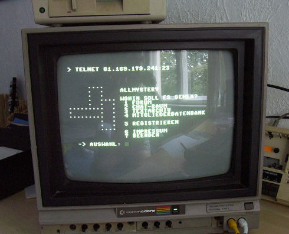
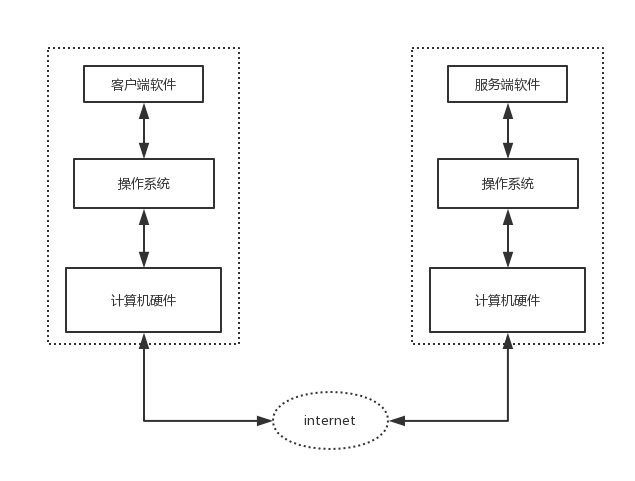
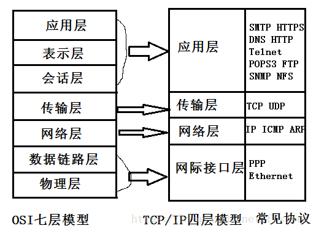
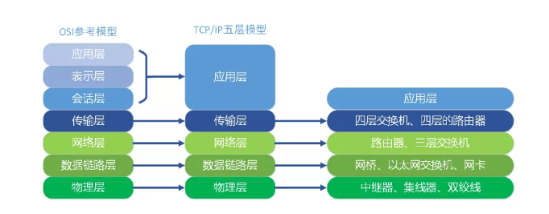

# 网络编程

## 一、计算机网络基础

计算机网络是独立自主的计算机互联而成的系统的总称，组建计算机网络最主要的目的是实现多台计算机之间的通信和资源共享。今天计算机网络中的设备和计算机网络的用户已经多得不可计数，而计算机网络也可以称得上是一个“复杂巨系统”，对于这样的系统，我们不可能用一两篇文章把它讲清楚，有兴趣的可以自行阅读Andrew S.Tanenbaum老师的经典之作《计算机网络》或Kurose和Ross老师合著的《计算机网络:自顶向下方法》来了解计算机网络的相关知识。

### 1.1 计算机网络发展史

####1. 1960s - 美国国防部ARPANET项目问世，奠定了分组交换网络的基础。

   

####2. 1980s - 国际标准化组织（ISO）发布OSI/RM，奠定了网络技术标准化的基础。

   

####3. 1990s - 英国人[蒂姆·伯纳斯-李](https://zh.wikipedia.org/wiki/%E6%8F%90%E5%A7%86%C2%B7%E6%9F%8F%E5%85%A7%E8%8C%B2-%E6%9D%8E)发明了图形化的浏览器，浏览器的简单易用性使得计算机网络迅速被普及。

   在没有浏览器的年代，上网是这样的。

   

   有了浏览器以后，上网是这样的。

   
   
####4. 网络通信的过程

   
   
### 1.2 C/S架构和B/S架构
 
 1. C指的是client（客户端软件），S指的是Server（服务端软件）
 2. B指的是brower（浏览器软件），S指的是Server（服务端软件）
 
### 1.3 TCP/IP四层模型

   
   
TCP/IP分层模型（TCP/IP Layening Model）被称作因特网分层模型(Internet Layering Model)、因特网参考模型(Internet Reference Model)。

在每一层都工作着不同的设备，比如我们常用的交换机就工作在数据链路层的，一般的路由器是工作在网络层的。
    
   
    
####1. 物理层
物理层可以理解为硬件层，负责光电信号传递方式。集线器工作在物理层，以太网协议。
这里的网络 pc 和交换机通过 phy连接，交换机也是通过 phy 和云连接。网络数据也是通过 phy 发送出去的。
   
####2. 链路层
负责设备之间的数据帧的传输和识别。交换机工作在数据链路层。例如网卡设备的驱动，帧同步，冲突检测，数据差错校验等工作。 
这一层加入了全球唯一的 MAC 地址，可以通过 MAC 地址让对方知道自己是哪个设备，告诉别人我是谁。
物理层完成了数据的传输，需要对0和1的定义进行规定。在传输0，1之后还需要对01进行分组。
#####以太网协议：
 + 早期的时候各个公司都有自己的分组方式，后来形成了统一的标准，即以太网协议ethernet。
ethernet规定一组电信号构成一个数据包，叫做‘帧’，每一数据帧分成：报头head和数据data两部分
#####mac地址：
 + head中包含的源和目标地址由来：ethernet规定接入internet的设备都必须具备网卡，发送端和接收端的地址便是指网卡的地址，即mac地址。
mac地址：每块网卡出厂时都被烧制上一个世界唯一的mac地址，长度为48位2进制，通常由12位16进制数表示（前六位是厂商编号，后六位是流水线号）

####3. 网络层
网络层是出现一些规范来进行约束，负责地址管理和路由选择。路由器工作在网络层。
##### IP地址：
 + 逻辑编址。将上层传递下来的数据添加逻辑地址信息(即IP地址)形成数据包。逻辑编址对与普通的通信服务是必须的，在互联网的环境中仅使用物理地址是不合适的，因为不同网络可以使用不同的物理地址格式。因此，需要一种通用的编址系统，用来唯一标志每一个主机，实现不同种物理网络间通信。
 + 习惯上，我们用分成四段的十进制数表示IP地址，从0.0.0.0一直到255.255.255.255。互联网上的每个设备，都会分配到一个IP地址。这个地址分成两个部分，前一部分代表网络，后一部分代表设备。目前广泛采用的是IPv4协议，这个协议规定，网址由32个bit组成。
##### 子网掩码：
 + 所谓”子网掩码”，就是表示子网络特征的一个参数。它在形式上等同于IP地址，也是一个32位二进制数字，它的网络部分全部为1，主机部分全部为0。比如，IP地址172.16.10.1，如果已知网络部分是前24位，主机部分是后8位，那么子网络掩码就是11111111.11111111.11111111.00000000，写成十进制就是255.255.255.0。
 + 子网掩码是用来标识一个IP地址的哪些位是代表网络位，以及哪些位是代表主机位。子网掩码不能单独存在，它必须结合IP地址一起使用。子网掩码只有一个作用，就是将某个IP地址划分成网络地址和主机地址两部分。
##### 路由：
 + 当许多独立的网络互联在一起组成互联网时，这些连接的设备就要选择合适的路径转发数据包，使其能够到达目标网络。
 + 在复杂的网络结构中，到达目标网络路径可能并不唯一，选择何种路径到达，是路由选择要解决的。

####4. 传输层
#####传输层的由来：
 + 网络层的ip帮我们区分子网，以太网层的mac帮我们找到主机，然后大家使用的都是应用程序，你的电脑上可能同时开启qq，暴风影音，迅雷等多个应用程序，
 + 那么我们通过ip和mac找到了一台特定的主机，如何标识这台主机上的应用程序呢？答案就是端口，端口即应用程序与网卡关联的编号。
#####传输层功能：
 + 建立端口到端口的通信
 + 端口范围0-65535，0-1023为系统占用端口
 + 知名端口：http:80/ftp:21/https:443等
#####TCP协议：
 + tcp协议是可靠传输协议（类似于打电话），TCP数据包没有长度限制，理论上可以无限长，但是为了保证网络的效率，通常TCP数据包的长度不会超过IP数据包的长度，以确保单个TCP数据包不必再分割。 每发出一个数据包都要求确认。如果有一个数据包遗失，就收不到确认，发出方就知道有必要重发这个数据包了。
 + 了解TCP建立、断开连接的过程：三次握手、四次挥手
#####UDP协议：
 + 不可靠传输（类似于发短信、寄信），”报头”部分一共只有8个字节，总长度不超过65,535字节，正好放进一个IP数据包。

####5. 应用层
应用层包括所有的高层协议。应用层不仅直接和应用程序接口而且提供常见的网络应用服务。
比起其它层来说，应用层需要的标准最多，但随着应用层的发展，各种特定应用服务的增多，应用服务的标准化开展了许多研究工作。
应用层就是根据之前的层次来封装一些场景应用，比如我们正常的网址，就是 http协议。
TCP 协议可以为各种各样的程序传递数据，比如 Email、WWW、FTP等等。那么，必须有不同协议规定电子邮件、网页、FTP数据的格式，这些应用程序协议就构成了"应用层"。 
#####相关协议:
 + 远程登陆协议(Telnet)：允许用户登陆到远程系统并访问远程系统的资源，而且可像本地用户一样访问远程系统。
 + 简单邮件传输协议(Simple Mail Transfer Protocol，SMTP)：最初只是文件传输的一种类型，后来慢慢发展成为一种特定的应用协议。
 + 文件传输协议(File Transfer Protocol，FTP)：提供在两台机器之间进行有效的数据传送的手段。
 + 超文本传输协议(Hyper Text Transfer Protocol ，HTTP)：用于从WWW上读取页面信息。
 + 其他应用层协议：例如将网络中的主机的名字地址映射成网络地址的域名服务(Domain Name Service，DNS);用于传输网络新闻的网络新闻传输协议(Network News Transfer Protocol，NNTP)等等
 