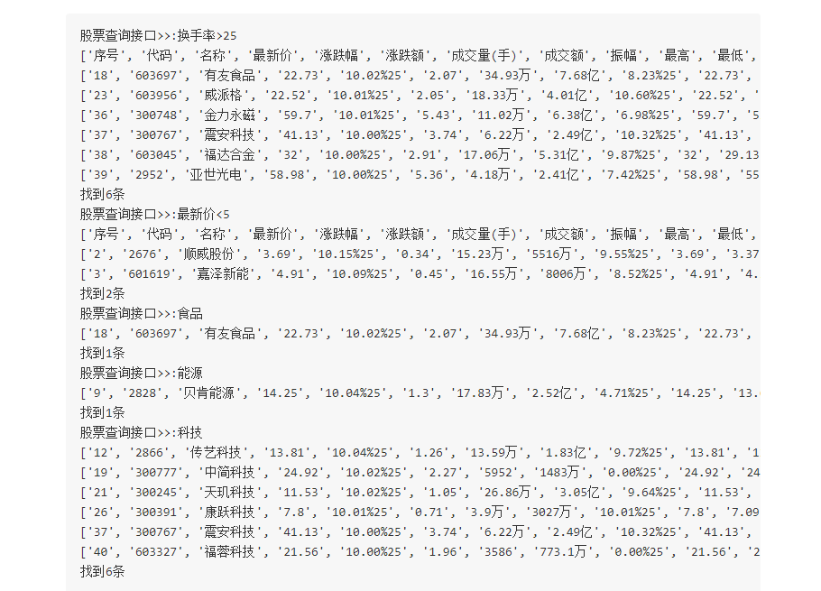

##文件操作

###1. 取出文件最后一行.py

###2. 文本编码.py

###3. 综合练习
开发程序对stock_data.txt进行以下操作：

1. 程序启动后，给用户提供查询接口，允许用户重复查股票行情信息(用到循环)

2. 允许用户通过模糊查询股票名，比如输入“啤酒”, 就把所有股票名称中包含“啤酒”的信息打印出来

3. 允许按股票价格、涨跌幅、换手率这几列来筛选信息，比如输入“价格>50”则把价格大于50的股票都打印，输入“市盈率<50“，则把市盈率小于50的股票都打印，不用判断等于。

思路提示：加载文件内容到内存，转成dict or list结构，然后对dict or list 进行查询等操作。 这样以后就不用每查一次就要打开一次文件了，效率会高。

程序运行效果：

 